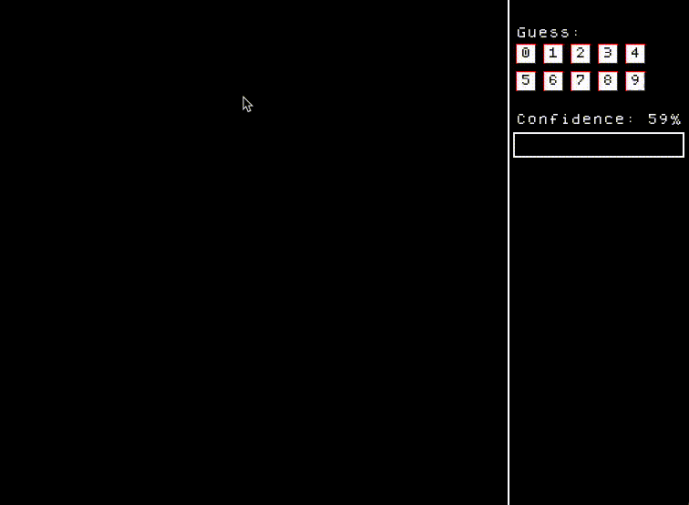
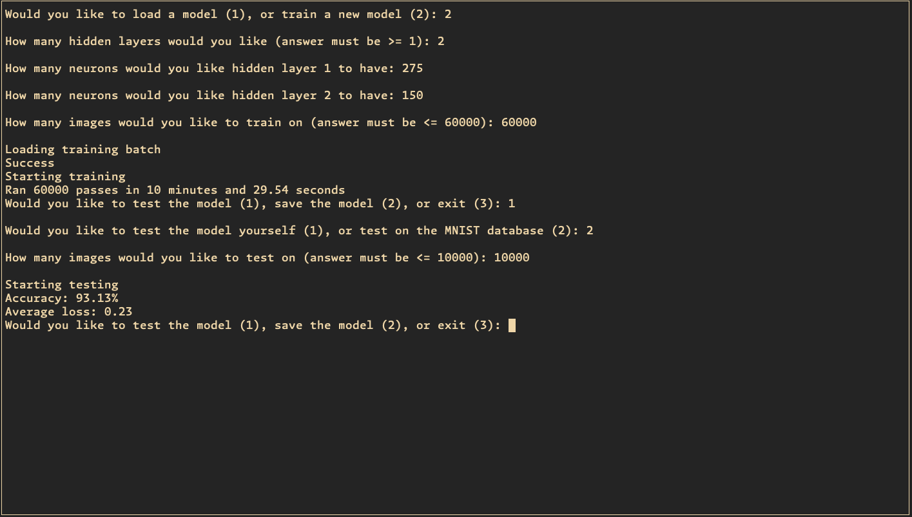

# neuralnet
#### First attempt at a neural network implementation from scratch
- MNIST dataset for training/testing
- Using only Eigen for Matrix operations and SFML for graphical output

#### Features
- Achieved a 93% accuracy with 2 hidden layers (275 and 125 neurons), ReLu/Softmax for activation
- Supports both Sigmoid and ReLu activation functions for hidden layers (change in source files to implement)
- ***Users can test their own handwritten digits (see below)***

#### Video / Screenshots
- Handwritten Digit Test

- Example CLI output/testing

